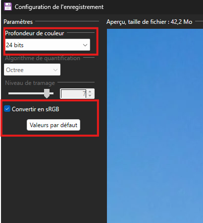

# DAI Practical Work 1 - hide and search specifical image pattern in bmp image

  

## Introduction
This project is a practical work of the course DAI (Developpement d'Application Internet) at the School of Business and Engineering Vaud.
The goal of this project is to hide and search a specific image pattern in a bmp image using Java language and the wrapper maven.
We have 2 pattern at choice:

| sus right                       | sus left                      |
|---------------------------------|-------------------------------|
|  |  |

This application is in command line, and we have to functionalities:
- hide one or more pattern in a bmp image
- search and count each occurrency of a pattern in a bmp image

## Tables of contents
- [Introduction](#introduction)
- [Tables of contents](#tables-of-contents)
- [Clone and build](#clone-and-build)
  - [For Linux / MacOS](#for-linux--macos)
  - [For Windows](#for-windows)
- [Usage](#usage)
  - [Context](#context)
  - [Format of the input file](#format-of-the-input-file)
    - [Change the extension of a file to bmp](#change-the-extension-of-a-file-to-bmp)
      - [For Windows users:](#for-windows-users)
      - [For Linux / MacOS users:](#for-linux--macos-users)
  - [The application](#the-application)
    - [Structure](#structure)
    - [Commands](#commands)
      - [Hide](#hide)
      - [Search](#search)
- [Authors](#authors)
- [Utilisation IA](#utilisation-ia)

## Clone and build
These following instructions will help you to get a copy of the project up and running on your local machine for development and testing purposes.

1. Clone the repository

  <pre><code class="language-bash">
# Clone with SSH
git clone git@github.com:Ischi-Leyre/dai-pw1-SUS.git
  </code></pre>

  <pre><code class="language-bash">
# Clone with HTTPS
git clone https://github.com/Ischi-Leyre/dai-pw1-SUS.git
  </code></pre>

2. Navigate to the project directory
~~~bash
cd dai-pw1-SUS
~~~

### For Linux / MacOS
Download the dependencies (only for the first time)
~~~bash
./mvnw dependency:go-offline
~~~

Build the project and generate the jar file
~~~bash
./mvnw clean package
~~~

### For Windows
Download the dependencies (only for the first time)
~~~bash
mvnw.cmd dependency:go-offline
~~~

Build the project and generate the jar file
~~~bash
mvnw.cmd clean package
~~~

> [!NOTE]
> 
> If you use the IDE IntelliJ, yon can directly run the configuration **mak jar file application** to automatic build the project and generate the jar file.

## Usage

### Context
This application take a bmp image as input, and hide or search a specific pattern in it.
You can find some example of bmp image in the folder `IOFiles/sources`.
- *windows_background.bmp* is an image without any pattern
- *windows_background_with_pattern.bmp* is the same image with many pattern hidden in it (but you can not find all in once execution)
- *HEIG-VD.bmp* is an image without any pattern
- *HEIG-VD_with_pattern.bmp* is the same image with many pattern hidden in it (only two execution to find all)

> [!NOTE]
> 
> If you use IntelliJ, you can find some configuration to test the functionalities.

### Format of the input file
This program can only accept bmp image as input file, but one particular version of bmp.
The bmp image must be:
- 24 bits per pixel (bpp) -> 8 bits for each color BGR (blue, green, red)
- uncompressed (no compression)
- Colorspace: sRGB

#### Change the extension of a file to bmp
If you have an image with another extension (like png or jpg or another format).

##### For Windows users:
you can convert it to bmp with an image editor like [Paint.NET](https://www.getpaint.net/download.html).
Just open your image with the editor, and save it with the extension bmp. After that, a new window will appear to choose the format of the bmp.
Make sure to choose the option 24 bits per pixel (bpp) when you save the image.
See the image below in red rectangle:

  

##### For Linux / MacOS users:
You can use the command line tool `convert` from the package `ImageMagick` to convert your image to bmp.
If you don't have `ImageMagick` installed, you can install it with these following steps:
1) **Install ImageMagick**
~~~sh  
sudo apt install imagemagick  
~~~  
2) **Check the installation**
~~~sh  
convert --version  
~~~  
3) **Convert one image PNG to BMP (format BMP3)**
~~~sh  
convert rondoudou.png -background white -alpha remove -alpha off -type TrueColor +profile "*" BMP3:rondoudou.bmp  
~~~
Source : [ImageMagick Convert Command Documentation](https://imagemagick.org/script/convert.php)

### The application

#### Structure
The jar file is in the folder `target` with the name `dai-pw1-SUS-1.0-SNAPSHOT.jar`.
The input and output files are in the folder `IOFiles`.

In the root of the project, you must open a terminal.

#### Commands
The application can be used with two commands:
- `hide` to hide one or more pattern in a bmp image
- `search` to search and count each occurrency of a pattern in a bmp image

#### Hide
This command has many options:
- '-c' or '--color' to choose the color of the pattern to hide (default is red). You can choose between almost 16 millions of colors with the BGR hexadecimal code (ex: '0,0,0xff' for red)
- '-n' or '--number' to choose the number of pattern to hide (default is 1, the maximum depends of the size of the input image)
- '-l' or '--left' to choose the pattern 'sus left' (default is 'sus right')
- '-o' or '--output' to choose the name of the output file (default is 'output.bmp')
- '-j' or '--json' to have a json file with the coordinates of each pattern hidden (default is no json file), the name of the json file is the same as the output file but with the extension .json

~~~bash
java -jar target/dai-pw1-SUS-1.0-SNAPSHOT.jar <input filename> hide [-c,-n,-o]=<value> [-l,-j,-h]
~~~ 

**Example:**
An example to hide 5 pattern 'sus right' in red color in the image 'windows_background.bmp' and save the result in 'win_bkgd_with_purple_sus.bmp':
~~~bash
java -jar target/dai-pw1-SUS-1.0-SNAPSHOT.jar IOFiles/sources/windows_background.bmp hide -c=0xff,0,0xff -n=5 -o=IOFiles/results/win_bkgd_with_purple_sus.bmp
~~~

#### Search
This command has many options:
- '-c' or '--color' to choose the color of the pattern to search (default is red). You can choose between almost 16 millions of colors with the BGR hexadecimal code (ex: '0,0,0xff' for red)
- '-f' or '--fill' to fill a copy of the input image with all in black except the pattern found (default is no fill image), the name of the fill image is the same as the input file but with the prefix 'out'.
- '-l' or '--left' to choose the pattern 'sus left' (default is 'sus right')

~~~bash
java -jar target/dai-pw1-SUS-1.0-SNAPSHOT.jar <input filename> search [-c]=<value> [-f,-l,-h]
~~~

**Example:**
An example to search the pattern 'sus right' in blue color in the image 'windows_background_with_pattern.bmp' and fill a copy of the input image with all in black except the pattern found:
~~~bash
java -jar target/dai-pw1-SUS-1.0-SNAPSHOT.jar IOFiles/sources/windows_background_with_pattern.bmp search -c=0xff,0,0 -f
~~~

## Authors
- **Ischi Marc**
- **Leyre Arnaut**

## Utilisation IA
The help of IA was the correction of some english mistakes in this README.md file with Microsoft Copilot.
The IA was used for generation of headers of class file (author, description).
The auto-completion of code was used for the getters of bmp header (methodes:`ByteBuffer.wrap(source, strat, lenght).order(ByteOrder.LITTLE_ENDIAN).getInt();`).

## References
- [PiccoCLI](https://picocli.info/)
- [Execptions handling in Java](https://programming.guide/java/exception-types.html)

### Acknowledgments

Special thanks to our peers for their valuable input, especially regarding:

- The clear and navigable structure of this README, which improves usability and onboarding.
- The Linux/macOS conversion method using ImageMagick, which made the application more accessible across platforms.
